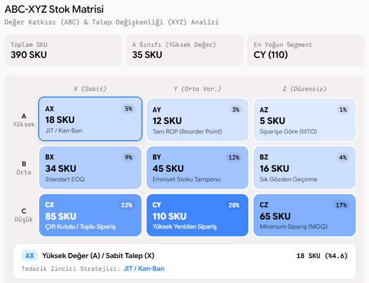

# 📊 Multi-Criteria Inventory Classification (ABC-XYZ Matrix)

A supply chain analytics framework that classifies inventory across financial consumption value (**ABC Analysis**) and demand forecastability (**XYZ Volatility Analysis**) to drive tailored replenishment policies.

## 📈 3x3 ABC-XYZ Matrix & Policy Heatmap

## 📌 Theoretical Framework
- **ABC Classification (Pareto Principle):**
  - **A Class:** Top ~80% of total monetary consumption value.
  - **B Class:** Intermediate ~15% of annual consumption value.
  - **C Class:** Bottom ~5% representing high volume, low fiscal impact.
- **XYZ Classification (Coefficient of Variation - $CV$):**
  - $CV = \frac{\sigma}{\mu}$
  - **X Class:** $CV < 0.25$ (Stable, predictable demand).
  - **Y Class:** $0.25 \le CV < 0.50$ (Moderate fluctuation).
  - **Z Class:** $CV \ge 0.50$ (Erratic, stochastic demand).

## 🚀 Key Features
- **Dual-Metric SKU Segmentation:** Automated allocation of inventory into 9 distinct operational cells.
- **Policy Mapping:** Connects each matrix cell directly to appropriate policies (e.g., JIT/Kanban for AX vs. Two-Bin for CX).
- **Interactive Heatmap Representation:** High-clarity visual overview of warehouse item distribution.

## 🛠️ Tech Stack
- Python 3.9+
- `pandas`, `numpy`, `matplotlib`
